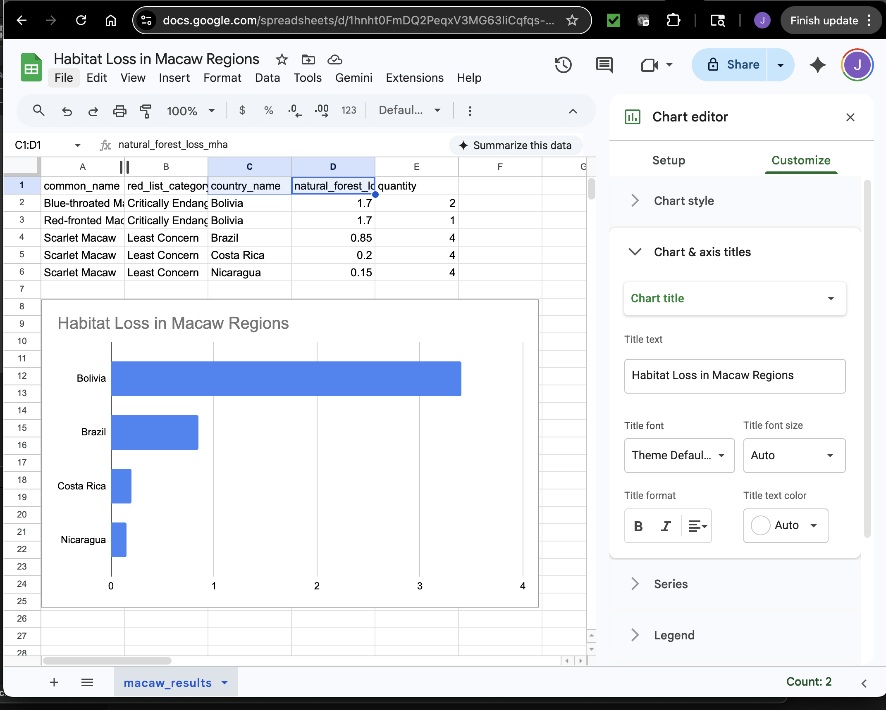
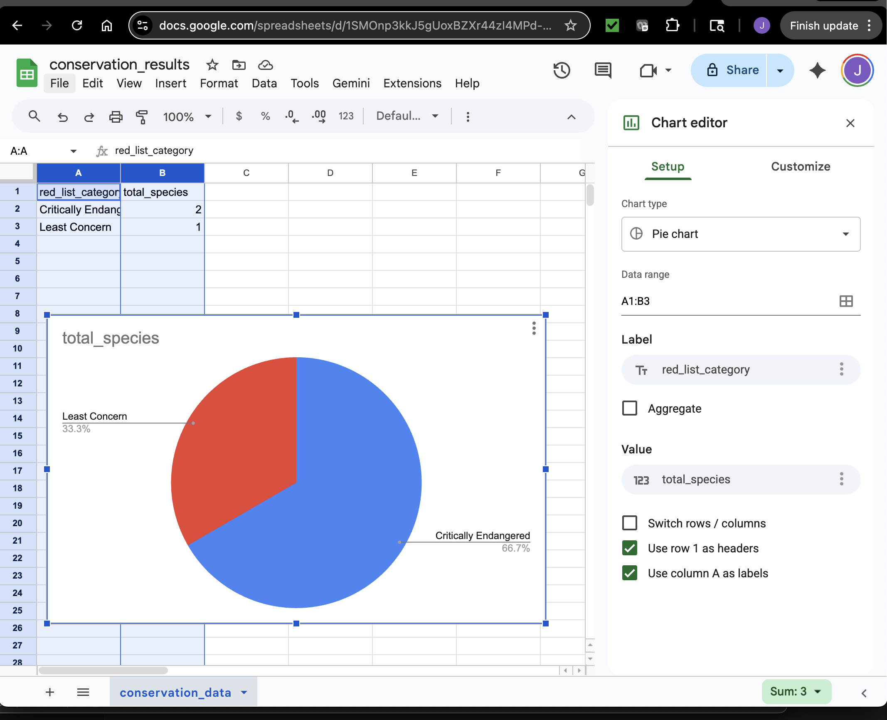
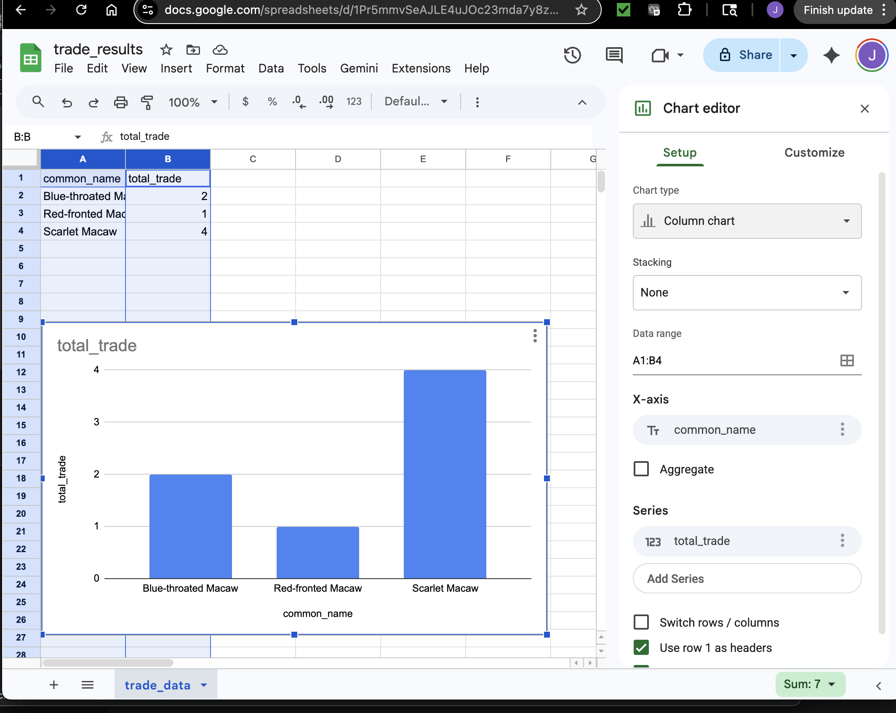

# 🦜 Macaw Population Decline Analysis (SQL Project)

## 📊 Overview
This project analyzes the decline of macaw populations using SQL.  
By combining species data, habitat loss data, and international trade records, 
this project identifies environmental and human factors impacting macaw survival.

---

## 🛠️ Tools Used
- MySQL Workbench
- SQL (Joins, Aggregations, Data Cleaning)
- CSV Data Processing

---

## 📁 Dataset
The project uses multiple datasets:
- macaw_species (species details and conservation status)
- countries (geographic locations)
- habitat_loss (environmental impact data)
- species_country_range (species distribution)
- trade_records (international trade data)

---

## ❓ Key Questions
- Which macaw species are declining?
- Which countries are most critical for macaw survival?
- How does habitat loss affect macaw populations?
- Are endangered species involved in international trade?

---
## 📁 Data Sources

This project uses structured CSV datasets including:

- macaw_species.csv  
- countries.csv  
- habitat_loss.csv  
- species_country_range.csv  
- trade_records.csv
--- 

## 🔍 Key SQL Concepts Used
- INNER JOIN
- LEFT JOIN
- COUNT() aggregation
- Relational database design
- Data cleaning (removing duplicates)

---
## 📊 Data Visualizations

### Habitat Loss by Country


### Conservation Status


### Trade Activity


## 👩‍💻 Author
Jasmin Luckett  
Aspiring Web Developer & Data Analyst  

🔗 GitHub: https://github.com/LuckettJasmin-FS-4  
🔗 LinkedIn: (add your link here if you have one)

## 📈 Example Query

```sql
SELECT
    s.common_name,
    s.red_list_category,
    c.country_name,
    h.natural_forest_loss_mha,
    t.quantity
FROM macaw_species s
JOIN species_country_range r
    ON s.species_id = r.species_id
JOIN countries c
    ON r.country_id = c.country_id
JOIN habitat_loss h
    ON c.country_id = h.country_id
LEFT JOIN trade_records t
    ON s.species_id = t.species_id;

